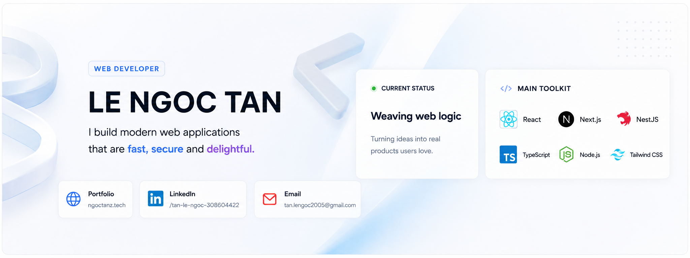
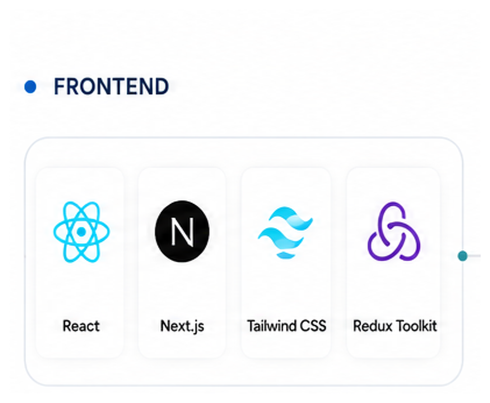
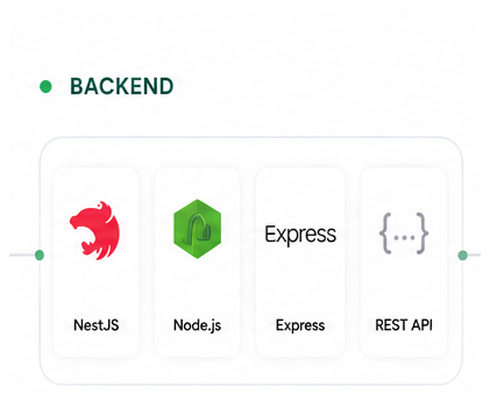
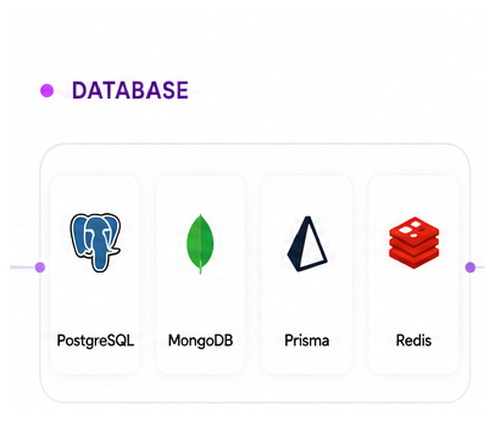
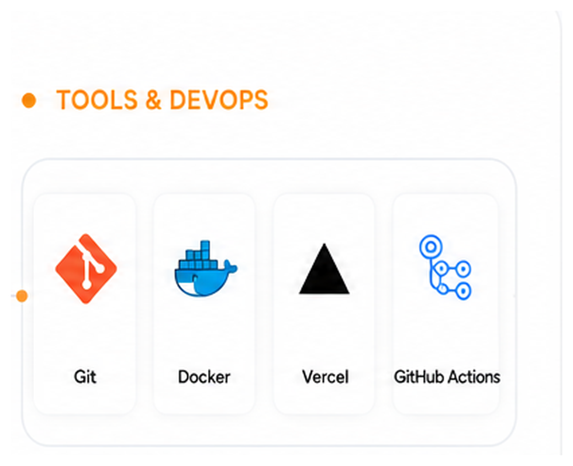
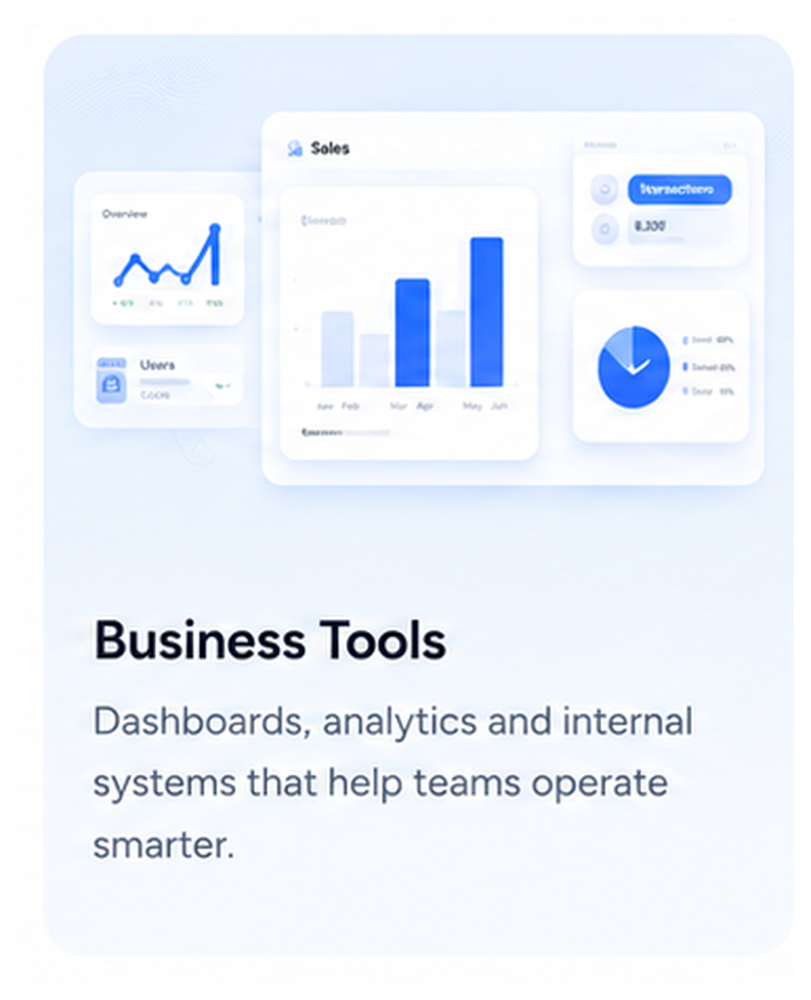
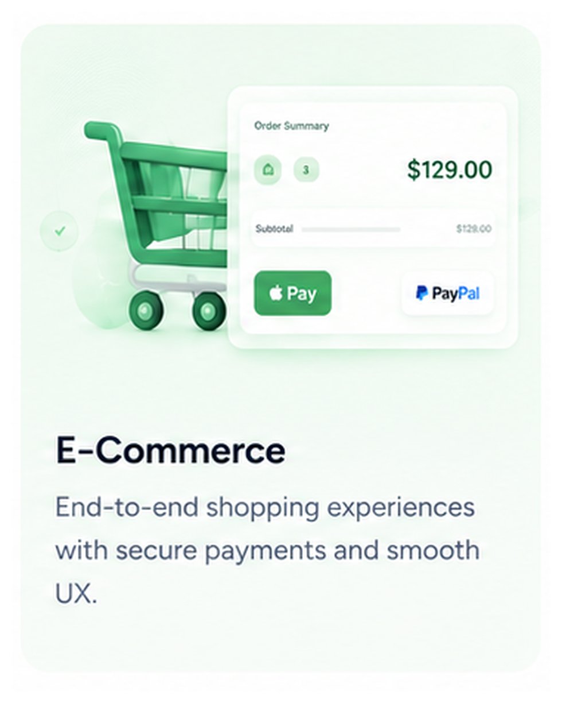
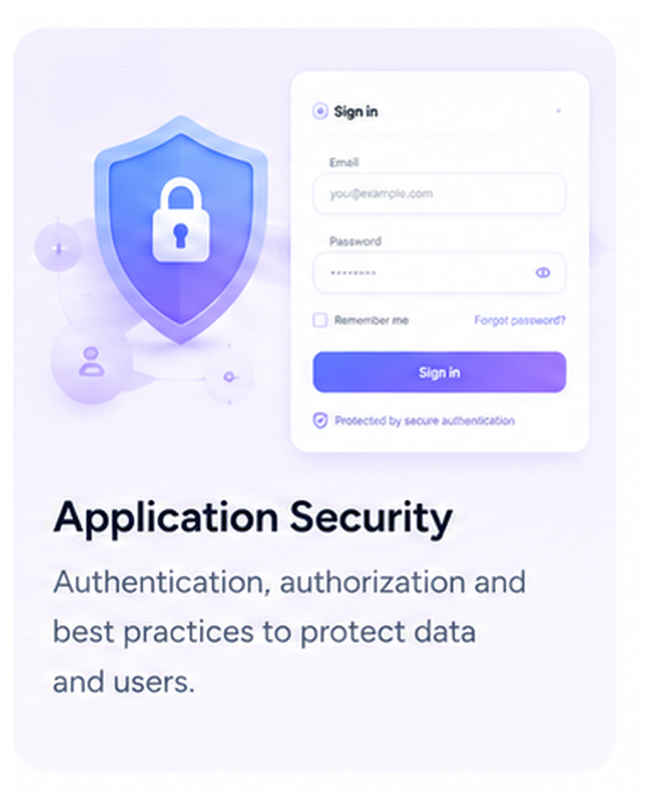
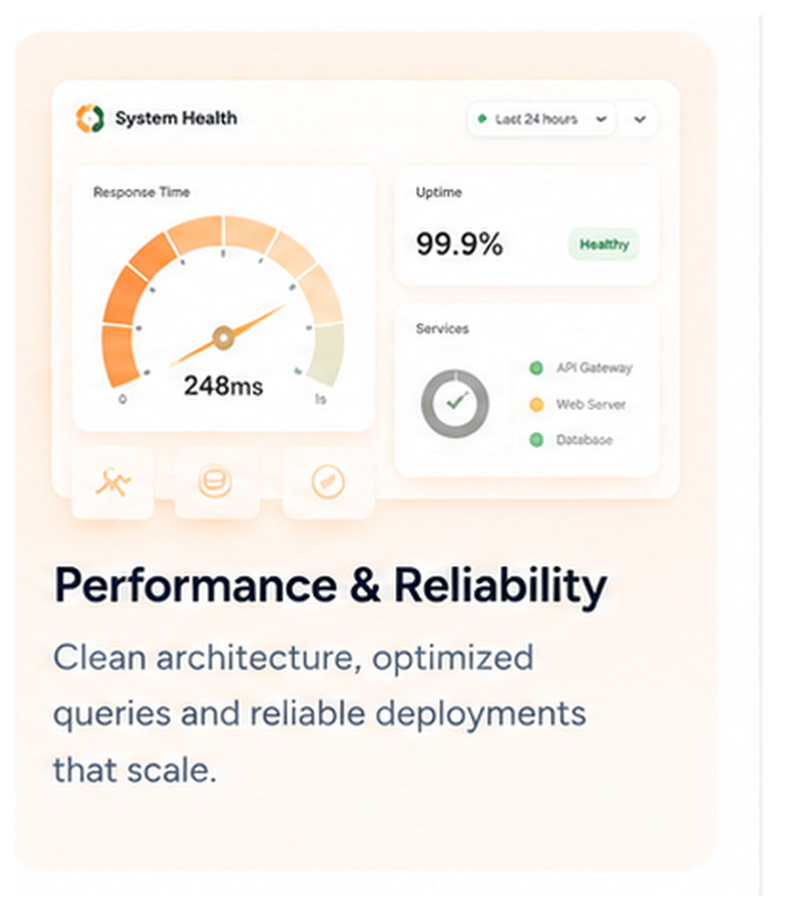
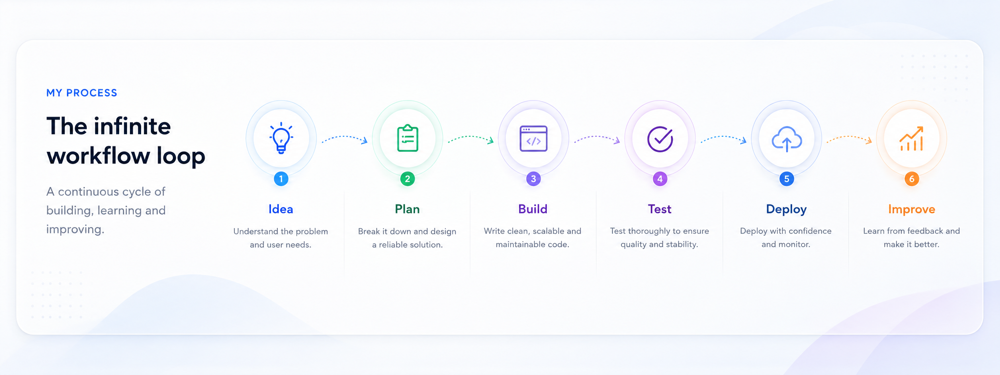

 

  

## About Me

I'm **Tân**, a **Web Developer** focused on creating modern web products that are fast, secure, reliable, and easy to use.

I work across the web stack with **React, Next.js, Node.js, NestJS, PostgreSQL, and MongoDB**. I enjoy solving practical problems involving business workflows, authentication, payment integrations, data processing, and application performance.

## Technology Stack

<table>
<tr>
<td width="50%" valign="top" align="center">

### Frontend

</td>
<td width="50%" valign="top" align="center">

### Backend

</td>
</tr>

<tr>
<td width="50%" valign="top" align="center">

### Database

</td>
<td width="50%" valign="top" align="center">

### Tools & Delivery

</td>
</tr>
</table>

## What I Focus On

<table>
<tr>
<td width="50%" valign="top" align="center">

</td>
<td width="50%" valign="top" align="center">

</td>
</tr>

<tr>
<td width="50%" valign="top" align="center">

</td>
<td width="50%" valign="top" align="center">

</td>
</tr>
</table>

## My Development Process

## Working Principles

<table>
<tr>
<td width="50%" valign="top">

### Clear Interface

Build for users, not for explanation. A good interface should feel natural and easy to understand.

</td>
<td width="50%" valign="top">

### Fail Gracefully

External APIs and payment services can fail. Recovery flows should be planned from the start.

</td>
</tr>
<tr>
<td width="50%" valign="top">

### Secure by Default

Authentication, authorization, validation, and data protection are core product features.

</td>
<td width="50%" valign="top">

### Maintainable Code

Prefer simple, readable solutions that are easier to test, improve, and scale.

</td>
</tr>
</table>

## Let's Build Something Useful

  

Build clearly. Ship reliably. Improve continuously.

