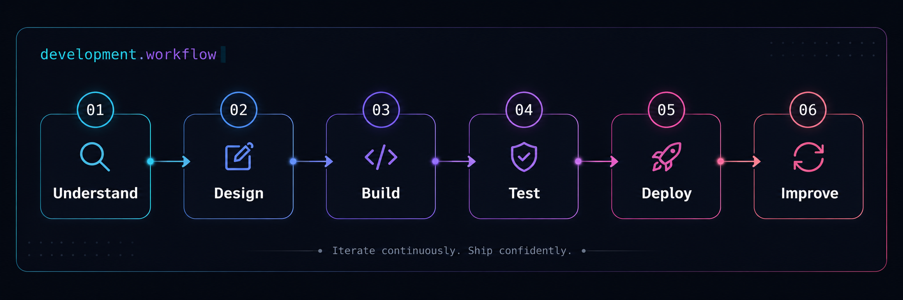

 

 

## About

I'm **Tân**, a **Web Developer** focused on creating web applications that are clean, responsive, secure, and easy to maintain.

My main stack includes **React, Next.js, Node.js, NestJS, PostgreSQL, and MongoDB**. I enjoy working on practical products that involve business workflows, authentication, payments, data processing, and performance.

---

## Core Toolkit

<table>
<tr>
<td align="center" width="33%" valign="top">

### Frontend

`Responsive UI`  
`Reusable Components`  
`SSR & App Router`

</td>
<td align="center" width="33%" valign="top">

### Backend & Data

`REST APIs`  
`Authentication & RBAC`  
`Data Modeling`

</td>
<td align="center" width="33%" valign="top">

### Tools

`Deployment`  
`API Testing`  
`Version Control`

</td>
</tr>
</table>

---

## What I Work On

<table>
<tr>
<td width="50%" valign="top">

### Business Applications

Internal tools, dashboards, POS workflows, inventory, invoices, permissions, and data-heavy management interfaces.

</td>
<td width="50%" valign="top">

### Commerce & Payments

Product flows, automated orders, third-party payment APIs, transaction safety, and failure recovery.

</td>
</tr>
<tr>
<td width="50%" valign="top">

### Application Security

OAuth, JWT and session authentication, RBAC, protected APIs, validation, and safe user data handling.

</td>
<td width="50%" valign="top">

### Performance & Reliability

Large-data processing, optimized queries, concurrent updates, fallback handling, and stable user experiences.

</td>
</tr>
</table>

---

## Development Workflow

---

## Working Principles

- **Keep the interface clear.** Users should understand what to do without extra explanation.
- **Plan for failure.** APIs, payments, and external services do not always respond as expected.
- **Protect the data.** Security and authorization are part of the product, not optional add-ons.
- **Prefer maintainable solutions.** Simple, readable code is easier to improve and scale.

---

### Build useful products. Improve them continuously.

