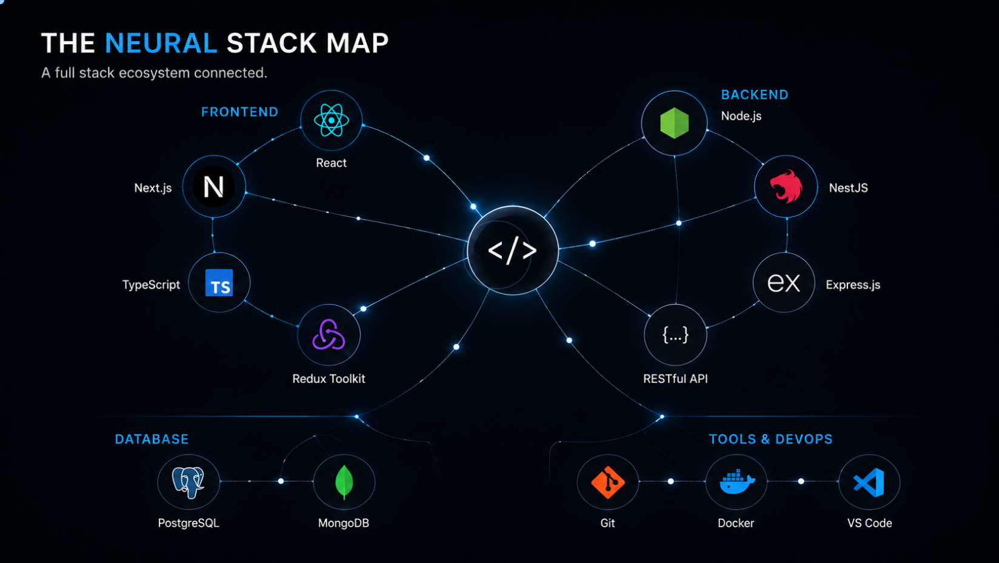
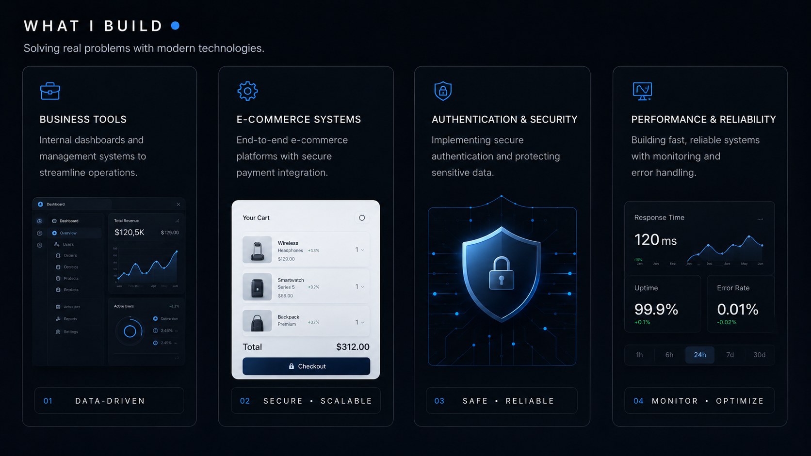

<div align="center">


<br/>

<a href="https://ngoctanz.tech"></a>
<a href="https://linkedin.com/in/tan-le-ngoc-308604422"></a>
<a href="mailto:tan.lengoc2005@gmail.com"></a>

</div>

<br/>


## About Me

I turn ideas into scalable web applications with clean interfaces, reliable systems, and maintainable architecture. I focus on products that remain secure, understandable, and easy to improve as they grow.

```ts
const developer = {
  name: "Le Ngoc Tan",
  role: "Full Stack Web Developer",
  currentStatus: "Building digital solutions",
  mainToolkit: ["React", "NestJS", "Next.js"],
  focus: [
    "Business applications",
    "E-commerce systems",
    "Authentication and security",
    "Performance and reliability",
  ],
  principles: ["Simple", "Secure", "Scalable", "Maintainable"],
};
```


## The Neural Stack Map

A connected view of the technologies I use to move an idea from interface to API, database, deployment, and continuous improvement.



<div align="center">

### Core Toolkit


</div>


## Specialized Working Modules

I enjoy working on systems where product experience and engineering quality matter equally.



<table>
<tr>
<td width="50%" valign="top"><h3>Business Tools</h3>Dashboards, internal platforms, management systems, reporting interfaces, and workflow tools that simplify operations.</td>
<td width="50%" valign="top"><h3>E-Commerce Systems</h3>Product discovery, carts, checkout, payment integration, order processing, and dependable customer journeys.</td>
</tr>
<tr>
<td width="50%" valign="top"><h3>Application Security</h3>Authentication, authorization, OAuth, JWT, protected routes, validation, encryption, and secure data handling.</td>
<td width="50%" valign="top"><h3>Performance & Reliability</h3>Fast APIs, database optimization, caching, monitoring, deployment health, and resilient integrations.</td>
</tr>
</table>


## The Infinite Workflow Loop

Understand the problem, design deliberately, build clearly, validate carefully, release safely, and improve from real feedback.


## Engineering Principles

<table>
<tr>
<td width="50%" valign="top"><h3>Clear Interfaces</h3>Build for users, not for explanation. The next action should feel obvious.</td>
<td width="50%" valign="top"><h3>Fail Gracefully</h3>Reliable systems anticipate network and service failures and recover clearly.</td>
</tr>
<tr>
<td width="50%" valign="top"><h3>Secure by Default</h3>Authentication, authorization, validation, and data protection are core requirements.</td>
<td width="50%" valign="top"><h3>Maintainable Code</h3>Prefer readable solutions over clever complexity. Simple code is easier to improve and scale.</td>
</tr>
</table>


## GitHub Activity

<div align="center">


<br/>


<br/>

<picture>
  <source media="(prefers-color-scheme: dark)" srcset="https://raw.githubusercontent.com/ngoctanz/ngoctanz/output/github-contribution-grid-snake-dark.svg" />
  <source media="(prefers-color-scheme: light)" srcset="https://raw.githubusercontent.com/ngoctanz/ngoctanz/output/github-contribution-grid-snake.svg" />
  
</picture>

</div>

<br/>

---

<div align="center">

### Build useful products. Improve them continuously.

<a href="https://ngoctanz.tech"></a>
<a href="mailto:tan.lengoc2005@gmail.com"></a>

<br/><br/>

<sub>Designed and built by Le Ngoc Tan.</sub>

</div>
