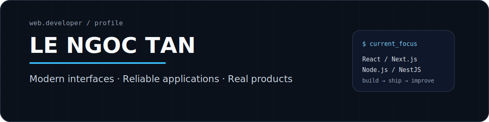
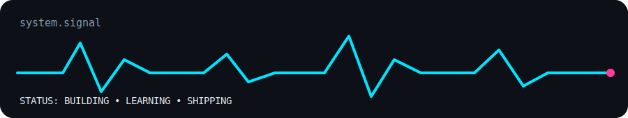

<div align="center">



<br/>

<a href="https://ngoctanz.tech"></a>
<a href="https://linkedin.com/in/tan-le-ngoc-308604422"></a>
<a href="mailto:tan.lengoc2005@gmail.com"></a>

<br/><br/>


</div>

<br/>

<table>
<tr>
<td width="61%" valign="top">

## About

I'm **Tân**, a **Web Developer** focused on building modern web products that feel fast, stay reliable, and solve real business problems.

I enjoy working across the web stack — from polished interfaces and reusable components to APIs, authentication, databases, payments, and performance.

### What I care about

```text
01  Clear user experience
02  Secure application flows
03  Stable data and transactions
04  Performance that scales
05  Maintainable code
```

</td>
<td width="39%" valign="top">

## Current Mode

```yaml
role: Web Developer
building:
  - web applications
  - business systems
  - payment flows
improving:
  - system design
  - backend architecture
  - performance
mindset: learn → build → ship
```

</td>
</tr>
</table>

<div align="center">
  
</div>

---

## Web Toolkit

<div align="center">

<table>
<tr>
<td align="center" width="33%">

### Interface


`Responsive UI` `Reusable Components`  
`SSR / App Router` `UX Performance`

</td>
<td align="center" width="33%">

### Application


`REST APIs` `Authentication`  
`Payments` `Data Modeling`

</td>
<td align="center" width="33%">

### Delivery


`Deployment` `Debugging`  
`Version Control` `API Testing`

</td>
</tr>
</table>

</div>

---

## What I Build

<table>
<tr>
<td width="50%" valign="top">

### Business Web Systems

Dashboards, internal tools, POS workflows, inventory, invoices, user roles, and data-heavy management screens.

</td>
<td width="50%" valign="top">

### Commerce & Payments

Product flows, order automation, third-party payment APIs, failure recovery, transaction safety, and SEO-friendly storefronts.

</td>
</tr>
<tr>
<td width="50%" valign="top">

### Secure Application Flows

OAuth, JWT/session authentication, RBAC, protected APIs, input validation, rate control, and safe user data handling.

</td>
<td width="50%" valign="top">

### Performance & Reliability

Large-data processing, optimized queries, concurrent updates, fallback handling, caching strategies, and stable user experiences.

</td>
</tr>
</table>

---

## GitHub Pulse

<div align="center">


<br/>


</div>

---

## Contribution City

<div align="center">


</div>

> Generated automatically by GitHub Actions. Run the included workflow once after uploading the files.

---

## A Little More Than Code

<table>
<tr>
<td width="58%" valign="top">

### Engineering Notes

- I prefer simple solutions before complex architecture.
- I care about what happens when an API fails, traffic grows, or data becomes inconsistent.
- I like interfaces that look clean without making users think.
- I treat security and error handling as product features.

</td>
<td width="42%" valign="top">

### Random Dev Quote

<div align="center">

</div>

</td>
</tr>
</table>

---

<div align="center">

### Let's build something useful.

<a href="https://ngoctanz.tech"></a>
<a href="mailto:tan.lengoc2005@gmail.com"></a>

<br/><br/>

<sub>Designed as a living developer profile — not just a list of technologies.</sub>

</div>
