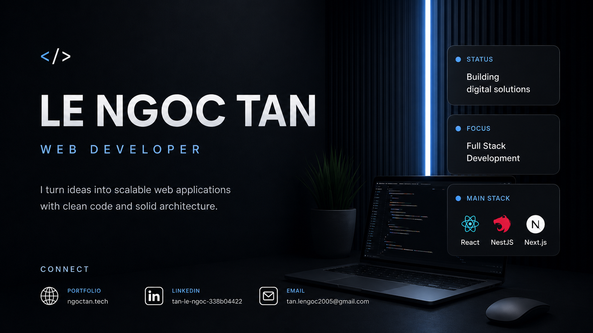
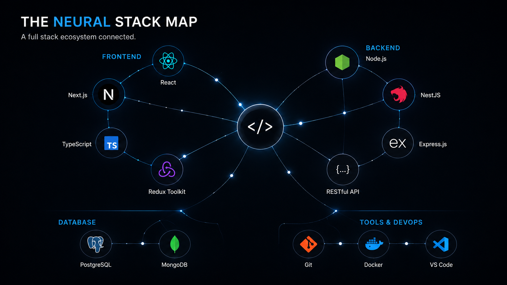
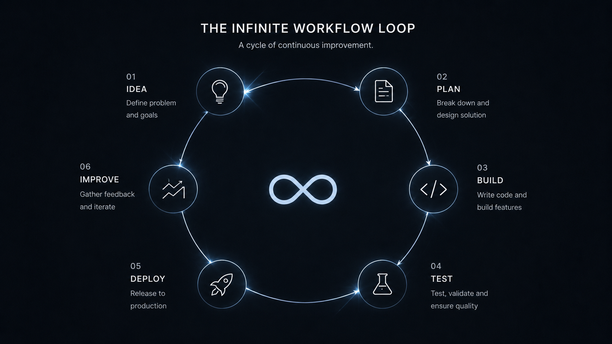

<div align="center">

# LE NGOC TAN

### Full Stack Web Developer

Building scalable web products with clean interfaces, reliable systems, and maintainable architecture.

<br/>

<a href="https://ngoctanz.tech">
  
</a>
<a href="https://linkedin.com/in/tan-le-ngoc-308604422">
  
</a>
<a href="mailto:tan.lengoc2005@gmail.com">
  
</a>

</div>

<br/>



<br/>

## About Me

I turn ideas into scalable web applications with clean code and solid architecture. My focus is building practical products that remain secure, understandable, and easy to improve as they grow.

```ts
const developer = {
  name: "Le Ngoc Tan",
  role: "Full Stack Web Developer",
  focus: [
    "Business applications",
    "E-commerce systems",
    "Authentication and security",
    "Performance and reliability",
  ],
  currentStatus: "Building digital solutions",
  principles: ["Simple", "Secure", "Scalable", "Maintainable"],
};
```

<br/>

## The Neural Stack Map

A connected view of the technologies I use to move an idea from interface to API, database, deployment, and continuous improvement.



<br/>

<div align="center">

### Core Toolkit


</div>

<br/>

## What I Build

I enjoy working on systems where product experience and engineering quality matter equally.


<br/>

<table>
<tr>
<td width="50%" valign="top">

### Business Tools

Dashboards, internal platforms, management systems, reporting interfaces, and workflow tools designed to make operations simpler and more measurable.

</td>
<td width="50%" valign="top">

### E-Commerce Systems

Product discovery, carts, checkout flows, payment integration, order processing, and dependable customer journeys.

</td>
</tr>
<tr>
<td width="50%" valign="top">

### Application Security

Authentication, authorization, OAuth, JWT, protected routes, validation, encryption, and secure handling of user data.

</td>
<td width="50%" valign="top">

### Performance & Reliability

Fast APIs, database optimization, caching, structured error handling, monitoring, deployment health, and resilient integrations.

</td>
</tr>
</table>

<br/>

## The Infinite Workflow Loop

Every strong product is built through a continuous cycle: understand the problem, design deliberately, build clearly, validate carefully, release safely, and improve from real feedback.



<br/>

## Engineering Principles

<table>
<tr>
<td width="50%" valign="top">

### Clear Interfaces

Build for users, not for explanation. A good interface should make the next action obvious.

</td>
<td width="50%" valign="top">

### Fail Gracefully

External services fail. Networks become unstable. Reliable systems anticipate failure and recover clearly.

</td>
</tr>
<tr>
<td width="50%" valign="top">

### Secure by Default

Authentication, authorization, validation, and data protection are core product requirements—not optional additions.

</td>
<td width="50%" valign="top">

### Maintainable Code

Prefer simple, readable solutions over clever complexity. Code that is easy to understand is easier to improve and scale.

</td>
</tr>
</table>

<br/>

## GitHub Activity

<div align="center">


<br/>


</div>

<br/>

---

<div align="center">

### Build useful products. Improve them continuously.

<a href="https://ngoctanz.tech">
  
</a>
<a href="mailto:tan.lengoc2005@gmail.com">
  
</a>

<br/><br/>

<sub>Designed and built by Le Ngoc Tan.</sub>

</div>
