 

  

---

## About

I'm **Tân**, a **Web Developer** focused on building web applications that are clear, responsive, secure, and easy to maintain.

My main stack includes **React, Next.js, Node.js, NestJS, PostgreSQL, and MongoDB**. I enjoy working on practical products involving business workflows, authentication, payments, data processing, and performance optimization.

---

## Tech Stack

### Frontend

  

### Backend

  

### Database

  

### Tools

  

---

## What I Build

<table>
<tr>
<td width="50%" valign="top">

### Business Applications
Internal tools, dashboards, POS workflows, inventory management, invoices, permissions, and operational systems.

</td>
<td width="50%" valign="top">

### Commerce & Payments
Product flows, order automation, third-party payment APIs, secure checkout, and failure recovery.

</td>
</tr>

<tr>
<td width="50%" valign="top">

### Application Security
OAuth, JWT and session authentication, RBAC, protected APIs, validation, and safe data handling.

</td>
<td width="50%" valign="top">

### Performance & Reliability
Large-data processing, optimized queries, concurrent updates, fallback handling, and stable user experiences.

</td>
</tr>
</table>

---

## Working Principles

- **Clear Interface** — build for users, not for explanation.
- **Fail Gracefully** — external APIs and services can fail, so recovery flows should be planned early.
- **Secure by Default** — authentication, authorization, and data protection are product features.
- **Maintainable Code** — prefer simple, readable solutions that are easier to test, improve, and scale.

---

## Let’s Build Something Useful

  

Build clearly. Ship reliably. Improve continuously.

